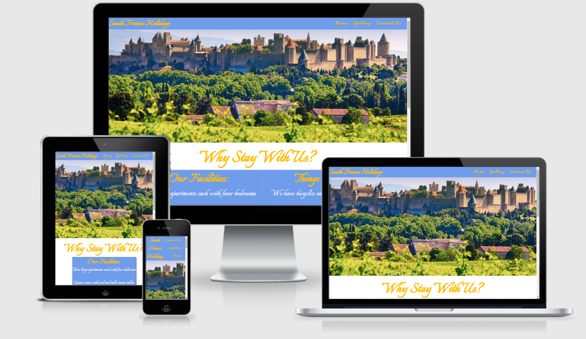

# South France Holidays

## Introduction

South France Holidays is a property made up of the main house with three villas connected. The property is available to rent for amazing prices and is situated only ten minutes from the beautiful medieval city of Carcassone. With over ten years experience in the industry we ensure you will have an unforgettable stay with us.
 

The overall aim of my project is the make an appealing website to showcase this stunning property.

A live website can be found [here](https://github.com/Ianokane1/SouthFranceHolidays)

# Table of Contents
 [1. User Expereince (UX) design](#ux)
  - [User Goals:](#user-goals)
  - [User Expectations:](#user-expectations)
  -	[Colour scheme and font](#color-scheme)
  - [Site skeleton (wireframes)-3 pages](#wireframes)
    - [Introduction page](#introduction-page)
    - [Theory page](#theory-page)
    - [Feedback page](#feedback-page)

      
  [2. Features](#features)

  [3.Technologies used](#technologies-used)

  [4.Testing](#testing)

  [5.Bugs](#bugs)

  [6. Deployment](#deployment)

  [7. Acknowledgement](#acknowledgement)