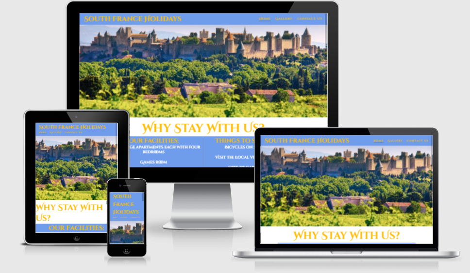
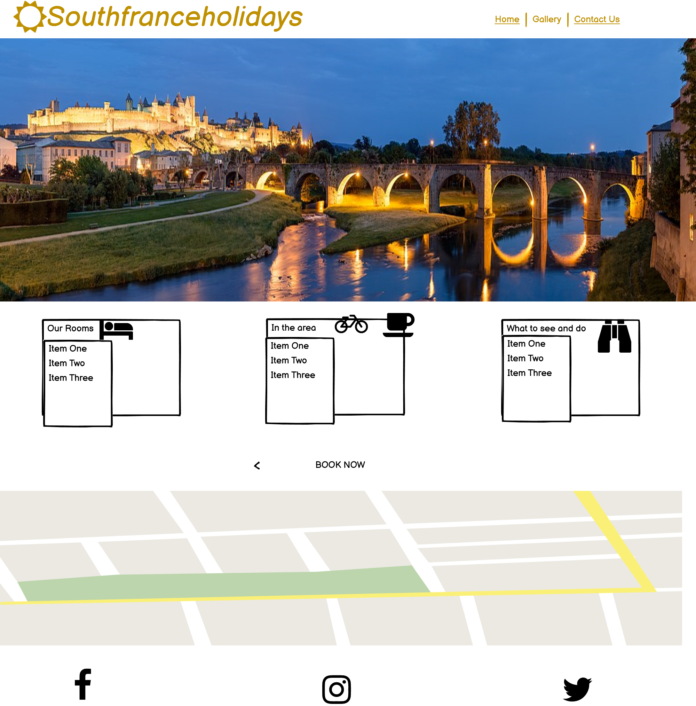
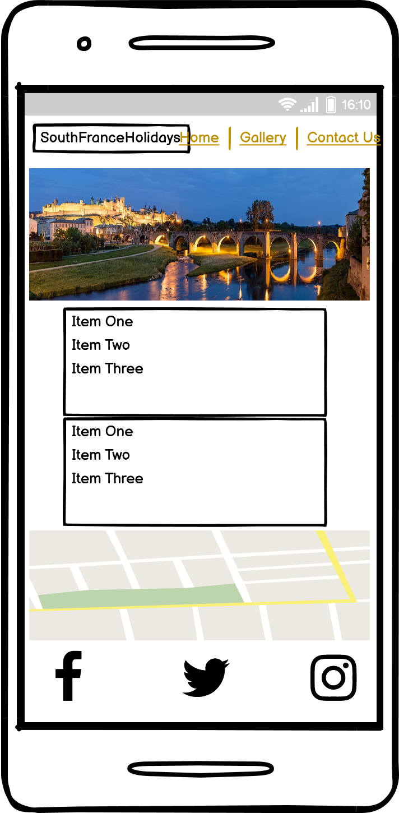
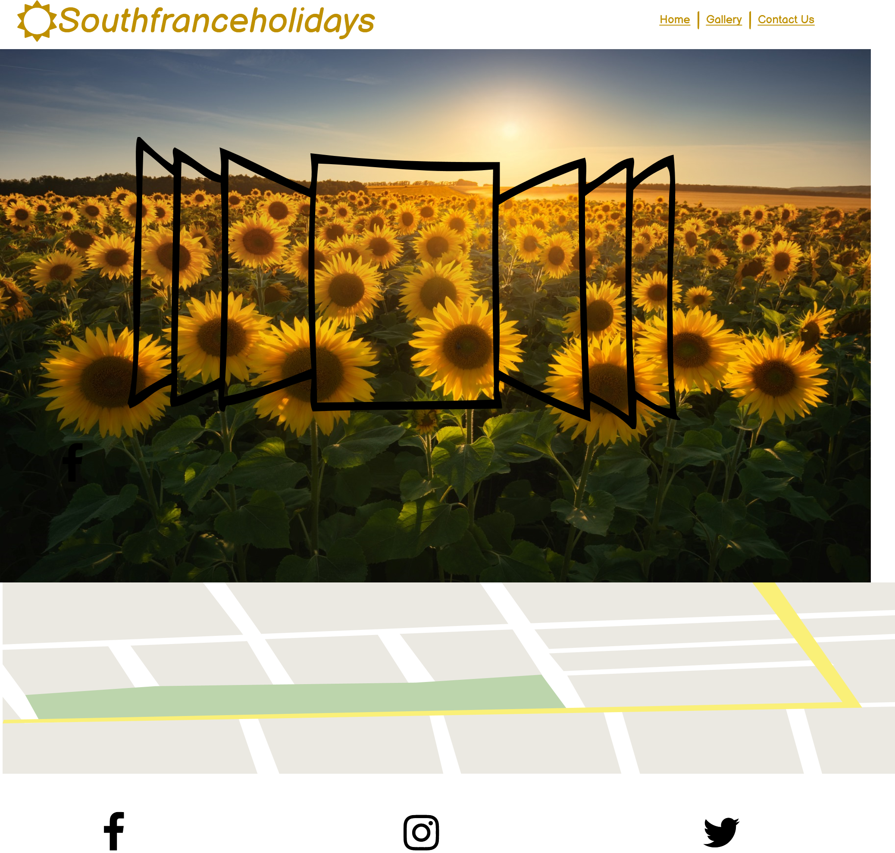
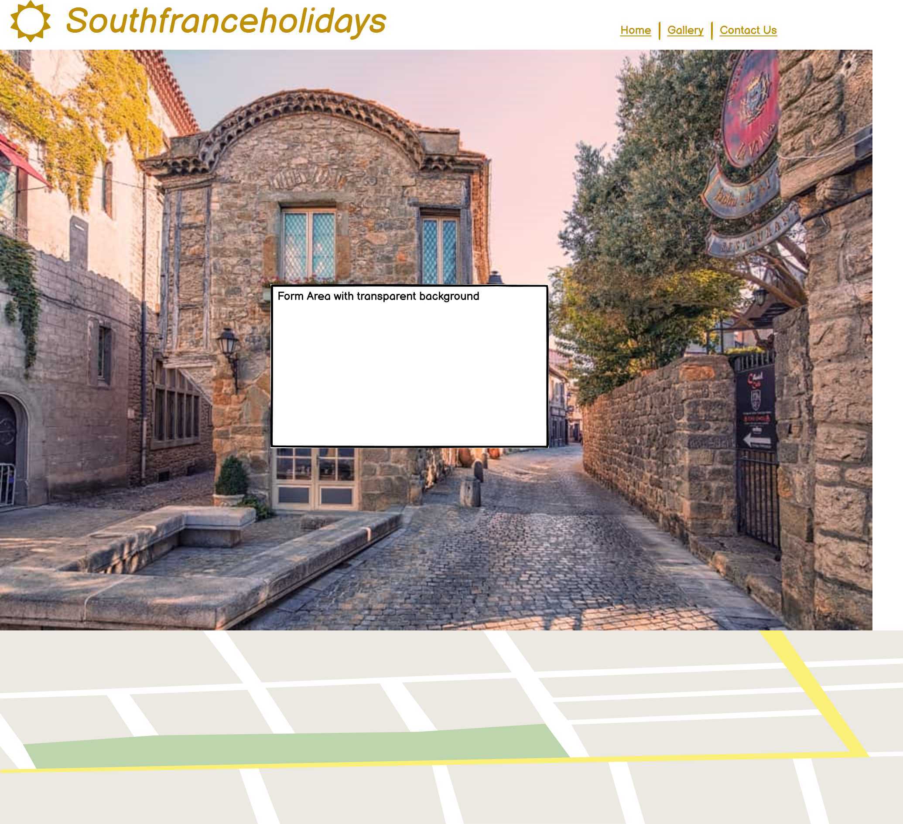

# South France Holidays

## Introduction

South France Holidays is a property made up of the main house with three villas connected. The property is available to rent for amazing prices and is situated only ten minutes from the beautiful medieval city of Carcassone. With over ten years experience in the industry we ensure you will have an unforgettable stay with us.
 

The overall aim of my project is the make an appealing website to showcase this stunning property.

A live website can be found [here](https://github.com/Ianokane1/SouthFranceHolidays)

# Table of Contents
 [1. User Expereince (UX) design](#ux)
  - [User Goals:](#user-goals)
  - [User Expectations:](#user-expectations)
  -	[Colour scheme and font](#color-scheme)
  - [Site skeleton (wireframes)-3 pages](#wireframes)
    - [Introduction page](#introduction-page)
    - [Theory page](#theory-page)
    - [Feedback page](#feedback-page)

      
  [2. Features](#features)

  [3.Technologies used](#technologies-used)

  [4.Testing](#testing)

  [5.Bugs](#bugs)

  [6. Deployment](#deployment)

  [7. Acknowledgement](#acknowledgement)

  
# 1. User Experience (UX) design
  [Go to the top](#table-of-contents)

  I wanted to the user to be able to navigate through the website easily without over burdening them with too much information. Three pages which include Home, Gallery and Contact Us which are all easily navigated. When researching other holiday websites I found there was too much going on. I opted to keep it simple for the user with presenting the right information. 

  
## 1.1 User Goals
  [Go to the top](#table-of-contents)

The main goal of this website is to showcase my families holiday home in south of France

## 1.2 User Expectations
  [Go to the top](#table-of-contents)

The website content provides information about about what we offer in this holiday home. We present the information via an about section on Home page as well as a Gallery so potential customers can see where they will stay.
* The site structure is designed considering the expectation of users to be simple and easy to use.
* The user interface is easy to navigate with three links in navbar
* Responsive design for all screen/device sizes like mobile, tablet and desktop.
* a link form provided for those users who will be interested to staying at the property.

## 1.3 Color Scheme
  [Go to the top](#table-of-contents)

Initially I opted to use #6F9CEB as the whole background. After some discussion with mentor we decided a white background would look better with some blue in the header as well in the about section. As for the font I liked the color #ffbe0b. I think it bounces off the other colors well and symbolises the color of the sun. 

Other foreground and background color used in the sites are
* foreground: #6F9CEB
* background: #white
* font: #ffbe0b

## 1.5 Site Skeleton
  [Go to the top](#table-of-contents)
 
[Balsamiq](https://balsamiq.com/) was used to create wireframes of the website. This was very useful as it gives the template of the UI. Wireframes were designed for web browser and a mobile browser format. The concept design (wireframes) of webpages (3 pages) prepared is presented below.

### Home Page

	

### Gallery Page
  

### Contact Us Page
  

