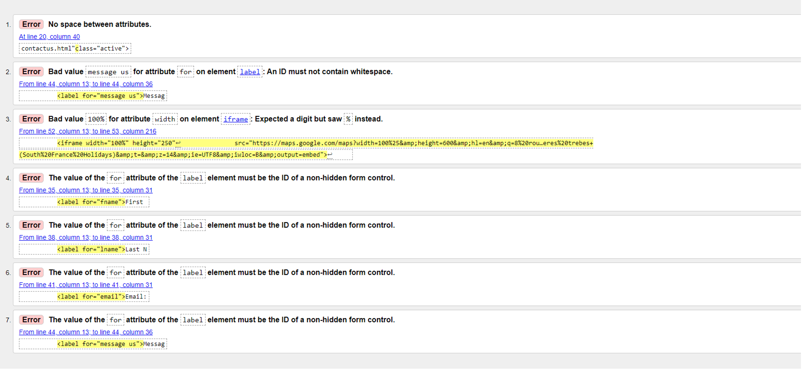

# South France Holidays

## Introduction

South France Holidays is a property made up of the main house with three villas connected. The property is available to rent for amazing prices and is situated only ten minutes from the beautiful medieval city of Carcassone. With over ten years experience in the industry we ensure you will have an unforgettable stay with us.
 

The overall aim of my project is the make an appealing website to showcase this stunning property.

A live website can be found [here](https://ianokane1.github.io/SouthFranceHolidays/)

# Table of Contents
 [1. User Expereince (UX) design](#ux)
  - [User Goals:](#user-goals)
  - [User Expectations:](#user-expectations)
  -	[Colour scheme and font](#color-scheme)
  - [Site skeleton (wireframes)-3 pages](#wireframes)
    - [Home Page](#home-page)
    - [Gallery Page](#gallery-page)
    - [Contact Us Page](#contactus-page)

      
  [2. Features](#features)

  [3.Technologies used](#technologies-used)

  [4.Testing](#testing)

  [5.Bugs](#bugs)

  [6. Deployment](#deployment)

  [7. Acknowledgement](#acknowledgement)

  
# 1. User Experience (UX) design
  [Go to the top](#table-of-contents)

  I wanted to the user to be able to navigate through the website easily without over burdening them with too much information. Three pages which include Home, Gallery and Contact Us which are all easily navigated. When researching other holiday websites I found there was too much going on. I opted to keep it simple for the user with presenting the right information. 

  
## 1.1 User Goals
  [Go to the top](#table-of-contents)

The main goal of this website is to showcase my families holiday home in south of France

## 1.2 User Expectations
  [Go to the top](#table-of-contents)

The website content provides information about about what we offer in this holiday home. We present the information via an about section on Home page as well as a Gallery so potential customers can see where they will stay.
* The site structure is designed considering the expectation of users to be simple and easy to use.
* The user interface is easy to navigate with three links in navbar
* Responsive design for all screen/device sizes like mobile, tablet and desktop.
* a link form provided for those users who will be interested to staying at the property.

## 1.3 Color Scheme
  [Go to the top](#table-of-contents)

Initially I opted to use #6F9CEB as the whole background. After some discussion with mentor we decided a white background would look better with some blue in the header as well in the about section. As for the font I liked the color #ffbe0b. I think it bounces off the other colors well and symbolises the color of the sun. 

Other foreground and background color used in the sites are
* foreground: #6F9CEB
* background: #white
* font: #ffbe0b

## 1.4 Site Skeleton
  [Go to the top](#table-of-contents)
 
[Balsamiq](https://balsamiq.com/) was used to create wireframes of the website. This was very useful as it gives the template of the UI. Wireframes were designed for web browser and a mobile browser format. The concept design (wireframes) of webpages (3 pages) prepared is presented below.

### Home Page

	

### Gallery Page
  

### Contact Us Page
  

# 2. Features
  [Go to the top](#table-of-contents)
 ### All 3 pages:
- Navigation bar is placed at the top right corner of the page, and considered a hover effect that underlines when we want to click the page as well as active page being underlined. The hover effect is placed to improve the user expereince.
- Site title is located top left of screen. Clicking this will return user to home screen
- Background color of nav bar and foreground color were chosen considering the contrast between background and foreground colours.
- Social media links (for facebook, Twitter, Youtube and Instagram) are placed at the bottom of the each page in the footer. All the links will open in a new tab. I added a hover effect to each link for style.

### Home page:
- Page title top left with nav bar top right.
- Zooming image of medieval city spanning width of page.
- About section showcasing what we are offering.
- Added a book now button with style that will send user to contact page.
- iframe showing location of site.
- Social media links.

The screenshot of Home page is below:

Home page UI:
  

### Gallery Page 
- Page title top left with nav bar top right.
- JavaScript carousel showcasing images of property
- iframe showing location of site.
- Social media links.

The screenshot of Gallery page is below:

Gallery page UI:
  

### Contact Us Page
- Page title top left with nav bar top right.
- Background image of cyclists in local village.
- Form for contacting us.
- iframe showing location of site.
- Social media links.

The screenshot of Contact Us page is below:

Contact Us page UI:
  

  The contact us form was correctly submitted  as  shown below.

 
# 3. Technologies Used
  [Go to the top](#table-of-contents)

* [HTML5](https://en.wikipedia.org/wiki/HTML5) (markup language) was used for structuring and presenting content of the website.
* [CSS3](https://en.wikipedia.org/wiki/CSS) (Cascading Style Sheets) was used to provide the style to the content written in a HTML.
* [Javascript](https://en.wikipedia.org/wiki/JavaScript) (programming language) was used for carousel
* [Balsamiq](https://balsamiq.com/) was used to create wireframes of the website (desktop and mobile version).
* [Google Fonts](https://fonts.google.com/) was used to import font-family "Lato" and "Oswald" into style,css file and which was used throughout the pages of the website.
* [Font Awesome](https://fontawesome.com/) was used to improt icons to the sites.
* [Chrome](https://www.google.com/intl/en_uk/chrome/) was used to debug and test the source code using HTML5 as well as to test site responsiveness.
* [Github](https://github.com/) was used to create the repository and to store the cproject's code after pushed from Git.
* [Gitpod](https://www.gitpod.io/) was used as the Code Editor for the site
* [W3C Markup](https://validator.w3.org/) and [Jigsaw validation](https://jigsaw.w3.org/) tools were used to validate the HTML code and CSS style used in the proejct.
* [Ami](http://ami.responsivedesign.is/#) was used to develop a Mockup screenshot generator
  
  # 4. Testing
  [Go to the top](#table-of-contents)
## 4.1 Testing using tools
### 4.1.1 Google Developer Tools
I make use of google developer tools (Chrome DevTools) as debugging tools. Using this tool I inspect for all the elements that I added in HTML and CSS style.

### 4.1.2 Responsive Tools

In order to make sure that design web pages are responsive to all device sizes, [Am I Responsive](http://ami.responsivedesign.is/) site was used to check it. 

### 4.1.3 W3C Validator Tools and bugs 

[W3C Markup](https://validator.w3.org/#validate_by_input+with_options) was used to check for any errors within my HTML pages.

See errors above

Errors resolved. Some warnings about sections and using h2-h6. After extensive research I found this were not errors but advisory. I opted not to change them. See above

See errors above

Errors resolved. Some warnings about sections and using h2-h6. After extensive research I found this were not errors but advisory. I opted not to change them. See above

See errors above

Errors resolved

[W3C CSS Validation](https://jigsaw.w3.org/css-validator/) was used to check for any error within my CSS stylesheet. No errors were found.

## 4.2 Manual Testing

I have tested my site on multiple devices. These include:
  - Galaxy S5 (360 x 640)
  - iPhone 5/6/7/8 (375 x 667) 
  - iPhone 6/7/8 plus (414 x 736)
  - ipad (768 x 1024)
  - iPad Pro (1024 x 1366)

Please find below my testing process for all pages via mobile and web:
 ## All 3 pages:
 ### Navigation bars

 TEST            | OUTCOME                          | PASS / FAIL  
--------------- | -------------------------------- | ---------------
Home | on click to "Home", the browser redirects me to the home page. The hoever effect (underline) appears when mouse is on "home".| PASS
Gallery | on click to "gallery page" the browser redirects me to the gallery page , The hoever effect (underline) appears when mouse is on "gallery". | PASS
Contact Us page| on click to "contact us page", the browser redirects me to the contact us page. The hoever effect (underline) appears when mouse is on "contact us page". | PASS
Responsive | All pages and elements were responsive (mobile and website) using differnt breakpoints.| PASS
Foreground & background  color| Checked foreground information is not distracted by backgrounds| PASS
Text|Checked if all fonts and colors used are consistent or not|PASS
Back to top|Checked if the page redirect to the top of the page when clicking the back to top on the bottom left corner of the page| PASS
Google map| Checked if google map when clicked on view larger map redirect to the google map page in new tab works ot not|PASS
|||

### Footer
TEST            | OUTCOME                          | PASS / FAIL  
--------------- | -------------------------------- | ---------------
Facebook | on clicking Facebook icon, a new tab opens and redirects to the Facebook website.| PASS
Twitter | on clicking Twitter icon, a new tab opens and redirects to the Twitter website.  | PASS
Youtube | on clicking Youtube icon, a new tab opens and redirects to the Youtube website.  | PASS
Instagram | on clicking Instagram icon, a new tab opens and redirects to the Instagram website.
Test hover | when hovering over icon it shows blue color | PASS
Google map| Checked if google map when clicked on view larger map redirect to the google map page in new tab works ot not|PASS

### Home page
TEST            | OUTCOME                          | PASS / FAIL  
--------------- | -------------------------------- | ---------------
Media| All images on the page load and zoom. All images were checked if it blurred in different screen sizes| PASS
Responsive | Responsive of the page in differnce screen sizes (mobile and website) using different breakpoints were checked.| PASS
internal link | Checked if the external link "Book Now" redirect to the contact us page.| PASS
Google map| Checked if google map when clicked on view larger map redirect to the google map page in new tab works ot not|PASS

### Gallery page
TEST            | OUTCOME                          | PASS / FAIL  
--------------- | -------------------------------- | ---------------
Media| All images on the pages load. All images were checked if it blurred in differnt screen sizes| PASS
Responsive | Responsive of the page in differnce screen sizes (mobile and website) using different breakpoints were checked.| PASS
Google map| Checked if google map when clicked on view larger map redirect to the google map page in new tab works ot not|PASS

## Contact Us page
TEST            | OUTCOME                          | PASS / FAIL  
--------------- | -------------------------------- | ---------------
Responsive | Responsive of the page in difference screen sizes (mobile and website) using different breakpoints were checked.| PASS
Send| Checked if send and button works or not|PASS
Form text| Checked if inputs on the forms works or not|PASS
Google map| Checked if google map when clicked on view larger map redirect to the google map page in new tab works ot not|PASS

# 5. Deployment
  [Go to the top](#table-of-contents)

The site was deployed to GitHub pages using the following steps:
- Sign up to GutHub
- Create a new repository on GitHub.
- Click on settings on the navigation bar under the repository title.
- Select pages on the left menu bar.
- Click on the master branch and save.
- This will now generate a link with your website live.
- The live link can be found here - (https://ianokane1.github.io/SouthFranceHolidays/)

# 6. Acknowledgement
  [Go to the top](#table-of-contents)
### Code
* The header and nav bar code came from the Love Running projects
* The code for image animation on index.html page came from the Love Running projects
* The carousel on gallery page came from https://www.section.io/engineering-education/how-to-make-an-image-carousel-for-your-website/
* Some minor coding for contact us page for was inspired from Love Running projects . 
* The icons in the footer and contact page came from [Font Awesome](https://fontawesome.com/)
* For README.md file, reference of https://github.com/dhakal79/Portfolio-project-MS1and and hhttps://github.com/Chris-McGonigle/emmas-beauty-parlour was considered. 
* Thanks to my mentor Marcel Mulders for his constructive feedback.

### Content
* Most of content came from my parents home in South France
* Some images taken from https://frenchmoments.eu/cite-of-carcassonne/
